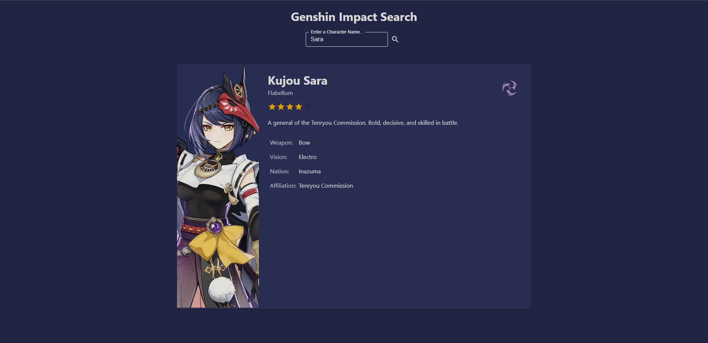
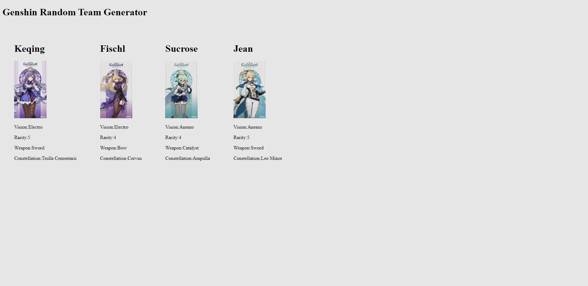

# MSA Phase 3 - Frontend

This project was bootstrapped with [Create React App](https://github.com/facebook/create-react-app).

## How to run:

In the project directory, you can run:

### `npm run dev`

# Genshin Impact Character Search

For this module, I decided to use a Genshin Impact API (Documentation [here](https://github.com/genshindev/api).)  
  
With this API, you can get the data of characters from the video game Genshin Impact. Using this data, I created a React Typescript web application that takes in user input (A characters name) and after clicking the search button, returns a card with the characters details on it. Below is an example of what the end product looks like:

  

[Here](https://msa-phase3-jd-frontend.vercel.app/) is the link to the Vercel app
      
# MSA Phase 3 - Backend
  # Genshin Team Randomizer API
This is an API that allows a user to generate a random team of Genshin Impact characters. In Genshin, a team comprises of 4 members. This API calls the [Genshin Impact API](https://github.com/genshindev/api) to get data for each character. To see the final result, you must call `https://localhost:{PORT}/Character/GetHTML`. This returns an HTML page with your randomised team on it! Below is an example:  

When running the project with `dotnet run --environment Development`, the API uses an InMemory database. When running the project with `dotnet run --environment Production`, the API uses an SQLite database.
  
After running the project with any of the two environments, call `https://localhost:{PORT}/Character/GetAPI` to populate the database. Next, call `https://localhost:{PORT}/Character/GetHTML` to get the final result.  
